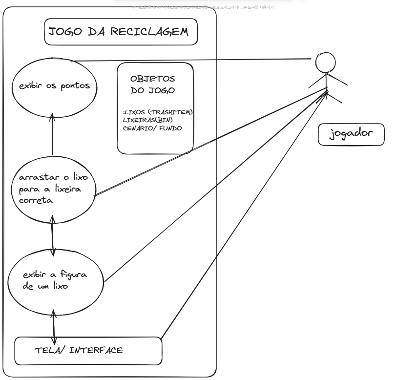
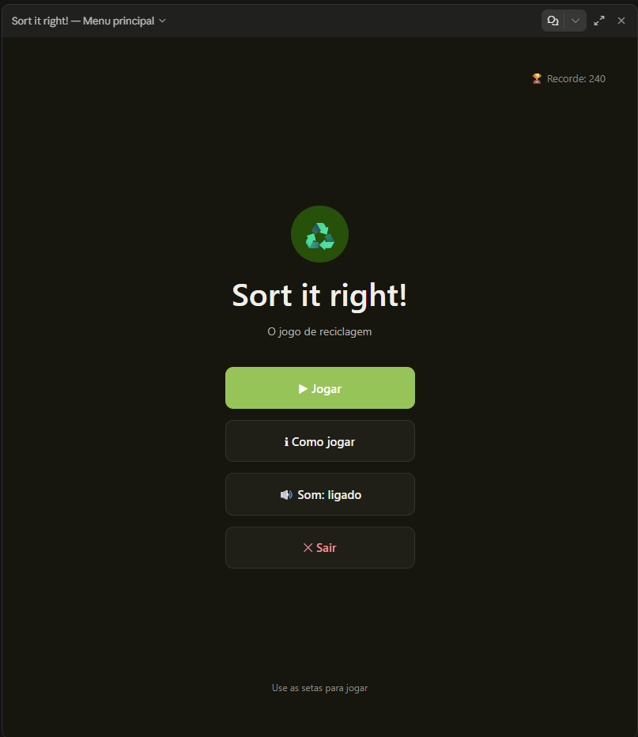

# 🎮 Jogo de Reciclagem — Sort It Right!

Um jogo 2D em Pygame onde o jogador precisa capturar itens de lixo com a lixeira correta antes que caiam da tela.

## 1. 👥 Título do Projeto e Membros da Equipe

**Titulo:** Jogo de Reciclagem — Sort It Right!

| Membro              | Função                            | Responsabilidades                                                                                           |
| ------------------- | --------------------------------- | ----------------------------------------------------------------------------------------------------------- |
| Tayler Guilherme 1  | Desenvolvedor Líder               | Lógica principal do jogo, loop de eventos, hierarquia de classes (`TrashItem`, `Bin`) e mecânica de colisão |
| Francoar Henrique 2 | Engenheiro de Gameplay e QA       | Balanceamento de velocidade/pontuação, ajuste de assets visuais e suíte de testes unitários automatizados   |
| Jose Trindade 3     | Designer de Assets e Level Design | Criação de sprites, sons e curva de dificuldade (velocidade de queda por fase)                              |
| Alan Miranda 4      | Product Owner / Documentação      | Gestão do backlog de issues no GitHub, critérios de aceite e redação do README                              |
| Carlos Henrique 5   | Engenheiro de Integração/DevOps   | Configuração do repositório, fluxo de branches/Pull Requests e pipeline de testes automatizados             |

## 2. 🎯 Declaração do Problema (Problem Statement)

Ao lidar com a separação de resíduos no dia a dia, as pessoas frequentemente enfrentam:

- Dificuldade em reconhecer rapidamente o tipo correto de material (vidro, plástico, papel, orgânico).
- Ausência de feedback imediato sobre erros de descarte, o que atrapalha a fixação do hábito correto.
- Materiais educativos tradicionais (cartazes, vídeos) são passivos e pouco engajantes para reforçar a memorização.

> **Solução:** este jogo transforma a categorização de resíduos em um desafio de reflexo em tempo real. Itens caem a 60 FPS, a colisão é validada via `rect.colliderect()` e a pontuação é dada instantaneamente, reforçando de forma lúdica e repetitiva o hábito da separação correta do lixo.

## 3. 🚀 Funcionalidades Principais do MVP

**Sistema de Entidades OOP**

- [x] Classes `TrashItem` e `Bin` encapsulando posição, velocidade e `waste_type` (vidro, plástico, papel, orgânico)
- [x] Método `update()` aplicando a velocidade de queda a cada frame

**Loop de Jogo e Colisão**

- [x] Clock a 60 FPS controlando o loop principal e a leitura das setas do teclado
- [x] Detecção de colisão 2D via `rect.colliderect()` entre o item e a lixeira do jogador
- [x] Pontuação: +10 pontos quando o `waste_type` do item bate com o `target_type` da lixeira, com reposicionamento automático do item no topo após a captura

## 4. ⚙️ Guia de Execução

**Instalar dependências**

```bash
pip install pygame
```

**Rodar a aplicação**

```bash
python main.py
```

**Executar os testes unitários**

```bash
python -m unittest discover -s tests
```
5. 📊 Esquema de Dados (Data Schema)

O estado do jogo é representado em dicionários JSON simples e serializáveis, prontos para salvar/carregar progresso:

Esquema de Item de Lixo (TrashItem)

json
{
  "id": "item_014",
  "x": 220,
  "y": 96,
  "velocity": 5,
  "waste_type": "plastico"
}

Esquema de Lixeira (Bin)

json
{
  "id": "bin_2",
  "x": 480,
  "y": 620,
  "target_type": "vidro"
}

Esquema de Sessão/Save (game_state.json)

json
{
  "score": 90,
  "high_score": 240,
  "sound_on": true,
  "rounds_played": 12,
  "last_played": "2026-09-17T13:31:00-03:00"
}
6. ⚙️ Guia de Execução

Instalar dependências

bash
pip install pygame

Rodar a aplicação

bash
python main.py

Executar os testes unitários

bash
python -m unittest discover -s tests


```

```



